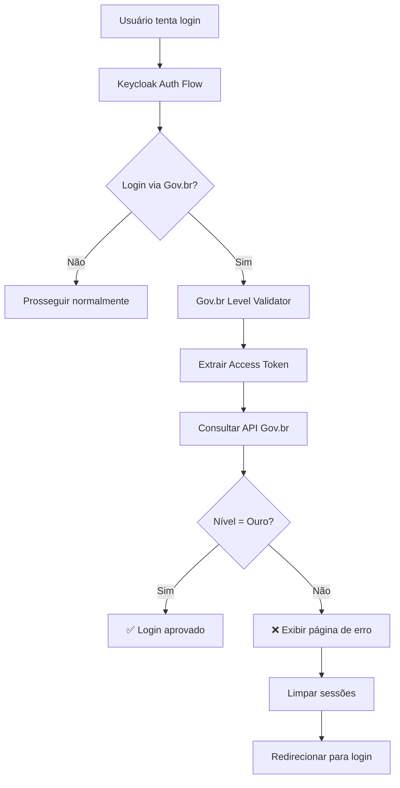

# Keycloak Gov.br Level Validator

Um SPI (Service Provider Interface) personalizado para Keycloak que valida o nível de autenticação Gov.br dos usuários durante o processo de login, garantindo que apenas usuários com nível **Ouro** tenham acesso ao sistema.

## 📋 Visão Geral

Este projeto implementa um **Authenticator** customizado que se integra ao fluxo de autenticação do Keycloak para:

- ✅ **Detectar** logins realizados via Identity Provider Gov.br
- 🔍 **Extrair** automaticamente o token de acesso da sessão federada
- 🌐 **Consultar** a API Gov.br para obter o nível de autenticação do usuário
- ⚖️ **Validar** se o nível atende aos critérios de segurança (apenas **Ouro**)
- 🛡️ **Bloquear** usuários com níveis insuficientes com páginas de erro personalizadas

## 🚨 Política de Validação

### ✅ **Login Aprovado**
- **Nível Ouro** → Acesso permitido

### ❌ **Login Bloqueado**
- **Nível Bronze/Prata** → Erro: "Nível de autenticação insuficiente"
- **Token inválido/expirado** → Erro: "Token de autenticação Gov.br inválido"
- **API indisponível** → Erro: "Serviço temporariamente indisponível"

## 🏗️ Arquitetura



## 🛠️ Tecnologias Utilizadas

- **Java 17**
- **Keycloak 24.0.0**
- **Jackson** (JSON processing)
- **HTTP Client** (Java 11+)
- **Maven**

## 📦 Instalação

### 1. **Pré-requisitos**

- Java 17+
- Maven 3.6+
- Keycloak 24.0.0+
- Identity Provider Gov.br configurado

### 2. **Build do Projeto**

```bash
# Clone o repositório
git clone [repository-url]
cd keycloak-govbr-level-validator

# Compile o projeto
mvn clean package

# O JAR será gerado em: target/keycloak-govbr-level-validator-1.0-SNAPSHOT.jar
```

### 3. **Deploy no Keycloak**

#### **Docker/Podman**
```bash
# Copie o JAR para o container
docker cp target/keycloak-govbr-level-validator-1.0-SNAPSHOT.jar keycloak_container:/opt/keycloak/providers/

# Reinicie o container
docker restart keycloak_container
```

#### **Instalação Standalone**
```bash
# Copie para o diretório providers
cp target/keycloak-govbr-level-validator-1.0-SNAPSHOT.jar $KEYCLOAK_HOME/providers/

# Rebuild e reinicie
$KEYCLOAK_HOME/bin/kc.sh build
$KEYCLOAK_HOME/bin/kc.sh start
```

## ⚙️ Configuração

### 1. **Identity Provider Gov.br**

Configure o Identity Provider no Admin Console:

```
Realm Settings → Identity Providers → Add Provider: OpenID Connect

Configurações:
├── Alias: gov-br
├── Display Name: Gov.br
├── Authorization URL: https://sso.staging.acesso.gov.br/auth/realms/govbr/protocol/openid_connect/auth
├── Token URL: https://sso.staging.acesso.gov.br/auth/realms/govbr/protocol/openid_connect/token
├── User Info URL: https://sso.staging.acesso.gov.br/auth/realms/govbr/protocol/openid_connect/userinfo
├── Client ID: [seu-client-id]
├── Client Secret: [seu-client-secret]
└── Store Tokens: ON (IMPORTANTE!)
```

### 2. **Authentication Flow**

1. **Acesse**: `Authentication → Flows`
2. **Duplique** o flow "Browser" (ex: "Browser Gov.br")
3. **Adicione Execution**:
   - **Provider**: `Gov.br Level Validator`
   - **Requirement**: `REQUIRED`
4. **Configure** o Realm para usar o novo flow em `Realm Settings → Authentication`

#### **Estrutura do Flow**
```
Browser Gov.br Flow:
├── Cookie (ALTERNATIVE)
├── Kerboak (DISABLED)
├── Identity Provider Redirector (ALTERNATIVE)
├── Gov.br Level Validator (REQUIRED) ← NOVO
└── Forms (ALTERNATIVE)
    ├── Username Password Form (REQUIRED)
    └── Browser - Conditional OTP (CONDITIONAL)
```

### 3. **Configurações da API**

Edite o arquivo `GovBrConfig.java` se necessário:

```java
public class GovBrConfig {
    // URL da API Gov.br
    public static final String NIVEL_API_URL = "https://api.gov.br/v1/govbr/nivel";
    
    // Timeout das requisições
    public static final int REQUEST_TIMEOUT = 30; // segundos
    public static final int CONNECT_TIMEOUT = 10; // segundos
    
    // Níveis aceitos (atualmente apenas Ouro)
    public static final String[] ACCEPTED_LEVELS = {"Ouro"};
}
```

## 🔍 Monitoramento e Logs

### **Configuração de Logs**

Adicione ao `log4j2.xml` do Keycloak:

```xml
<Logger name="br.com.spi.govbr" level="INFO" additivity="false">
    <AppenderRef ref="CONSOLE"/>
    <AppenderRef ref="FILE"/>
</Logger>
```

### **Exemplos de Logs**

```bash
# Login aprovado
INFO  [br.com.spi.govbr.service.LevelValidationService] ✅ Login aprovado - Nível: Ouro

# Login rejeitado
WARN  [br.com.spi.govbr.service.LevelValidationService] ❌ Login rejeitado - Nível Bronze insuficiente

# Erro de token
ERROR [br.com.spi.govbr.service.GovBrApiClient] Token Gov.br inválido ou expirado

# API indisponível
ERROR [br.com.spi.govbr.service.GovBrApiClient] API Gov.br temporariamente indisponível
```

## 🎨 Interface do Usuário

O SPI inclui páginas de erro personalizadas e responsivas que:

- 📱 **Responsive Design** para mobile e desktop
- 🎨 **Visual moderno** com gradientes e animações
- 📋 **Informações educativas** sobre os níveis Gov.br
- 🔄 **Botões de ação** para tentar novamente
- 🌐 **Links úteis** para aumentar o nível

### **Preview das Páginas de Erro**

- **Nível Insuficiente**: Explica a necessidade do nível Ouro
- **Token Inválido**: Orienta a fazer login novamente
- **Serviço Indisponível**: Informa sobre indisponibilidade temporária

## 🧪 Testes

### **Cenários de Teste**

1. **Login com Nível Ouro** → ✅ Deve permitir acesso
2. **Login com Nível Prata/Bronze** → ❌ Deve bloquear com página de erro
3. **Token expirado** → ❌ Deve exibir erro de token inválido
4. **API indisponível** → ❌ Deve exibir erro de serviço indisponível
5. **Login não-Gov.br** → ✅ Deve prosseguir normalmente

### **Testando Manualmente**

```bash
# 1. Configure um usuário Gov.br com nível Bronze/Prata
# 2. Tente fazer login
# 3. Verifique se a página de erro é exibida
# 4. Verifique os logs do Keycloak
```

## 🔧 Desenvolvimento

### **Estrutura do Projeto**

```
src/main/java/br/com/spi/govbr/
├── authenticator/          # Authenticator principal e Factory
├── config/                 # Configurações e constantes
├── dto/                    # DTOs e handlers de resposta
├── exception/              # Exceções customizadas
├── service/                # Lógica de negócio
└── util/                   # Utilitários (extração de token, limpeza de sessão)
```

### **Principais Classes**

- **`GovBrLevelAuthenticator`**: Authenticator principal
- **`LevelValidationService`**: Serviço de validação de nível
- **`GovBrApiClient`**: Cliente HTTP para API Gov.br
- **`GovBrErrorResponseHandler`**: Gerador de páginas de erro
- **`TokenExtractor`**: Extração de tokens da sessão federada

### **Extending o Projeto**

Para aceitar outros níveis, modifique:

```java
// Em GovBrConfig.java
public static final String[] ACCEPTED_LEVELS = {"Prata", "Ouro"};
```

## 🛡️ Segurança

- 🔒 **Limpeza de sessões** automática em caso de erro
- 🚫 **Bloqueio imediato** de usuários não autorizados
- 🔐 **Validação de tokens** com tratamento de expiração
- 📝 **Logs auditáveis** de todas as tentativas de acesso
- ⏱️ **Timeouts configuráveis** para evitar ataques de lentidão

## 📊 Métricas

O SPI registra métricas importantes através dos logs:

- **Taxa de aprovação/rejeição** por nível
- **Erros de token** e **indisponibilidade da API**
- **Tentativas de acesso** por usuário
- **Performance** das consultas à API Gov.br

## 🐛 Troubleshooting

### **Problemas Comuns**

| Problema | Possível Causa | Solução |
|----------|---------------|---------|
| SPI não carregado | JAR não está em `providers/` | Verificar localização e reiniciar Keycloak |
| Token não encontrado | "Store Tokens" desabilitado no IdP | Habilitar nas configurações do Gov.br IdP |
| Erro 401/403 | Token expirado ou inválido | Usuário deve fazer login novamente |
| Timeout na API | Rede lenta ou API instável | Verificar conectividade e configurar timeouts |

### **Debug Avançado**

```bash
# Habilitar debug completo
echo 'logger.br-com-spi-govbr.level=DEBUG' >> $KEYCLOAK_HOME/conf/keycloak.conf

# Verificar se SPI foi carregado
grep "Gov.br Level Validator" $KEYCLOAK_HOME/data/log/keycloak.log

# Verificar requisições HTTP
grep "GovBrApiClient" $KEYCLOAK_HOME/data/log/keycloak.log
```

## 📝 Changelog

### **v1.0-SNAPSHOT**
- ✅ Validação de nível Ouro Gov.br
- ✅ Páginas de erro personalizadas e responsivas
- ✅ Limpeza automática de sessões
- ✅ Logs estruturados para auditoria
- ✅ Tratamento robusto de erros da API
- ✅ Suporte a timeouts configuráveis

## 🤝 Contribuição

1. **Fork** o projeto
2. **Crie** uma branch para sua feature (`git checkout -b feature/nova-funcionalidade`)
3. **Commit** suas mudanças (`git commit -am 'Adiciona nova funcionalidade'`)
4. **Push** para a branch (`git push origin feature/nova-funcionalidade`)
5. **Abra** um Pull Request

## 📄 Licença

Este projeto está licenciado sob a licença MIT - veja o arquivo [LICENSE](LICENSE) para detalhes.

## 📞 Suporte

Para suporte e dúvidas:

- 📧 **Email**: [seu-email@empresa.com]
- 📋 **Issues**: [GitHub Issues](https://github.com/seu-usuario/keycloak-govbr-level-validator/issues)
- 📚 **Documentação**: [Wiki do Projeto](https://github.com/seu-usuario/keycloak-govbr-level-validator/wiki)

---

**⚠️ Importante**: Este SPI requer que o Identity Provider Gov.br esteja corretamente configurado com a opção "Store Tokens" habilitada para funcionar adequadamente.